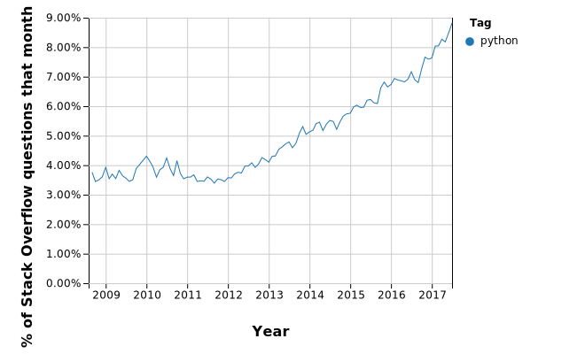

# Введение

Здесь и далее  будут даны неформальные определения различных понятий из области программирования и разработки ПО.
## Что такое программирование?
Друзья, программирование это в первую очередь ежедневное решение разных головоломок. Поэтому, если вам не нравится решать головоломки, программирование сделает вас несчастным.
### Головоломки? О чём вы?
Всё правильно. Любой разработчик, идущий в ногу со временем, ежечасно решает ряд головоломок, связанных с кодом.
Некоторые из них настолько просты, часто их появлиение и решение остаются для программиста незаметными.

> Хм... эти данные приходят с удалённого сервиса, их предварительно надо провалидировать, затем передать в наш сервис, где к ним будут привязаны уже наши данные. Тэк-с, что если наш сервис упадёт, тогда мы не сможем снова запросить эти данные и они пропадут... надо их положить в асинхронную очередь, которую будет слушать наш сервис... и не забыть включить дюрабилити в кролике...

Примерно такую чушь прямо сейчас бормочет себе под нос какой-нибудь прогер.
Хорошие новости: головоломки - это интересно! А когда за их решение тебе ещё и платят деньги, так это вообще лучше не придумаешь.

### Код

Код, кодирование, кодеры... Код - это язык, который способен понимать ваш глубый компьютер. Да, искусственный интеллект ещё не дошёл до того, чтобы ему можно было бы объяснять свои задачи и он бы их правильно, с первой попытки, понимал.

Это всё в недалёком будущем. А пока мы вынуждены всё для него разжёвывать на понятном ему языке.

Писать чистый машинный код сложно назвать весёлым занятием. Бородатые дядьки это быстро смекнули и сделали для нас с вами кучу удобных инструментов - языков программирования. Таких как C, Java, Scala, Go, JavaScript, Ruby и конечно наш любимый Python (Пайтон или Питон), который мы и будем использовать.

